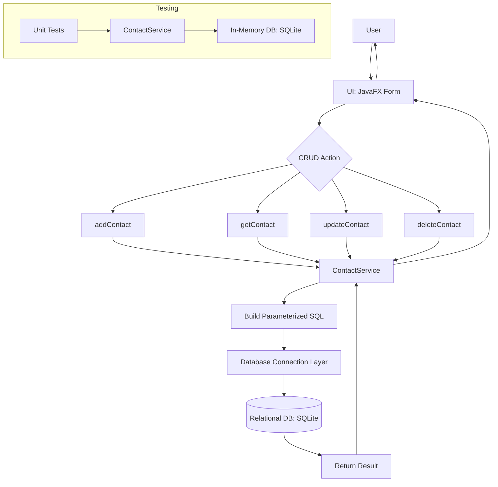
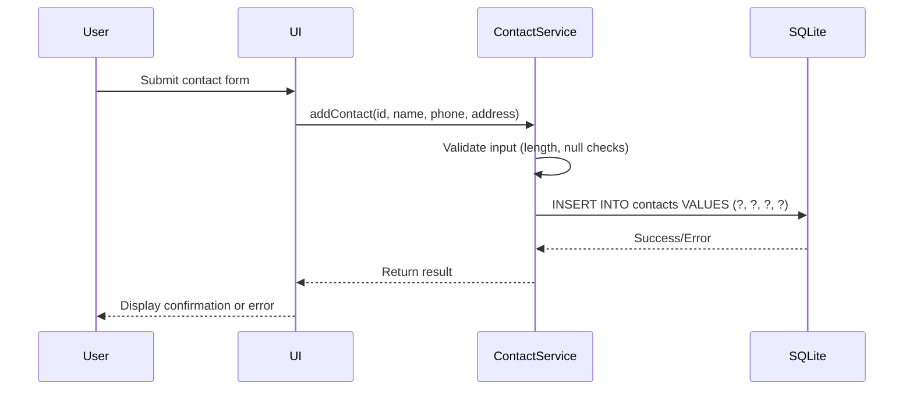

```mermaid
flowchart TD
    A[User] --> B[UI: JavaFX Form]
    B --> C{CRUD Action}
    C --> D[addContact]
    C --> E[getContact]
    C --> F[updateContact]
    C --> G[deleteContact]
    D --> H[ContactService]
    E --> H
    F --> H
    G --> H
    H --> I[Build Parameterized SQL]
    I --> J[Database Connection Layer]
    J --> K[(Relational DB: SQLite)]
    K --> L[Return Result]
    L --> H
    H --> B
    B --> A

    subgraph Testing
        M[Unit Tests] --> N[ContactService]
        N --> O[In-Memory DB: SQLite]
    end
```

**Data flow for a single CRUD operation:**

```mermaid
sequenceDiagram
    participant User
    participant UI
    participant ContactService
    participant DB as SQLite

    User->>UI: Submit contact form
    UI->>ContactService: addContact(id, name, phone, address)
    ContactService->>ContactService: Validate input (length, null checks)
    ContactService->>DB: INSERT INTO contacts VALUES (?, ?, ?, ?)
    DB-->>ContactService: Success/Error
    ContactService-->>UI: Return result
    UI-->>User: Display confirmation or error
```
