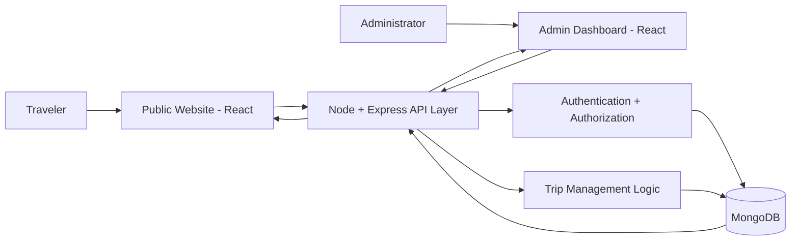
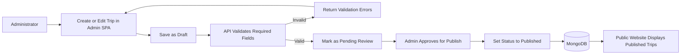

# Travlr Getaways

Source: CS 465 Full Stack Application Development

The Travlr Getaways project creates a functional travel booking website. Its primary function is to securely store trip data in MongoDB, serve it via Node and Express APIs, and allow administrators to dynamically manage, update, and display vacation packages through a React admin dashboard.

## High-Level Application Flow


### Running the App

First-time setup (installs dependencies for the API and both frontends):
```
npm install                        # from travlr/, installs app_api dependencies
npm --prefix apps/public install   # installs the public site's dependencies
npm --prefix apps/admin install    # installs the admin dashboard's dependencies
```

Then, one command (from `travlr/`) runs the API and both frontends together via `concurrently`:
```
npm run dev
```
- API (Express + Mongo) → http://localhost:3000
- Public/travel site → http://localhost:5173
- Admin dashboard → http://localhost:5174

Or run any of them individually in their own terminal:
```
npm run dev:api      # Express + Mongo API on http://localhost:3000
npm run dev:public   # React public/travel site on http://localhost:5173
npm run dev:admin    # React admin dashboard on http://localhost:5174
```

`app_api` requires a local MongoDB instance at `mongodb://127.0.0.1:27017/travlr` (override with the `DB_HOST` env var). Seed sample trip data with `node app_api/models/seed.js`.

### High-Level Flow (Publishing Workflow)


### Pseudocode (Publish Endpoint Logic)
```text
function publishTrip(tripCode, user):
    if user.role != "admin":
        return 403 Forbidden

    trip = findTripByCode(tripCode)
    if trip is null:
        return 404 Not Found

    errors = validateTripForPublish(trip)
    if errors is not empty:
        return 400 Bad Request with errors

    trip.status = "Published"
    trip.lastReviewedBy = user.email
    trip.lastReviewedAt = now()
    save(trip)

    return 200 OK with trip
```

