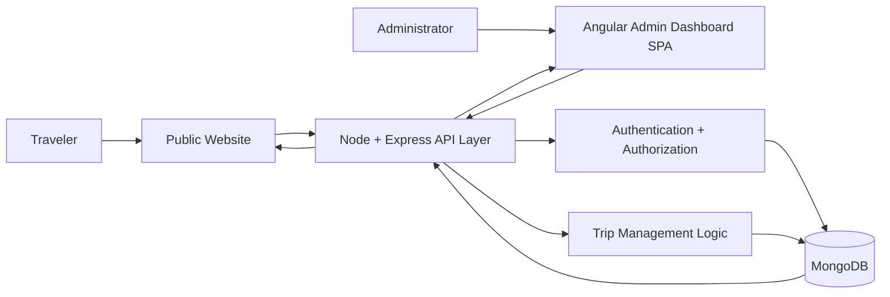

# Travlr Getaways

Source: CS 465 Full Stack Application Development

The Travlr Getaways project creates a functional travel booking website using the MEAN stack. Its primary function is to securely store trip data in MongoDB, serve it via Node and Express APIs, and allow administrators to dynamically manage, update, and display vacation packages through a single-page Angular dashboard.

## High-Level Application Flow

