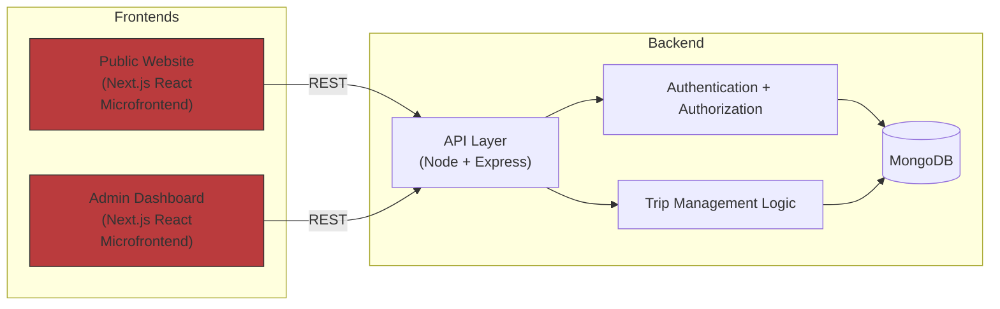

# Updated Architecture — React + Next.js Microfrontends

## PROPOSAL
Consolidate both the Public site and the Admin dashboard into React microfrontends built with Next.js to separate server and client concerns, standardize the stack for easier maintainability, enable component and design-system reuse, speed developer onboarding, improve developer productivity and testing consistency, and allow incremental migration and independent deployments for faster iteration.

## Architecture Diagram

## Notes
- Both frontends use Next.js (React) as microfrontends so teams share tooling, CI, and component libraries.
- Backend remains Node/Express with MongoDB; APIs are unchanged but become first-class clients for multiple frontends.
- Microfrontend approach enables incremental migration, independent release cadence, and better isolation for admin-only features.
