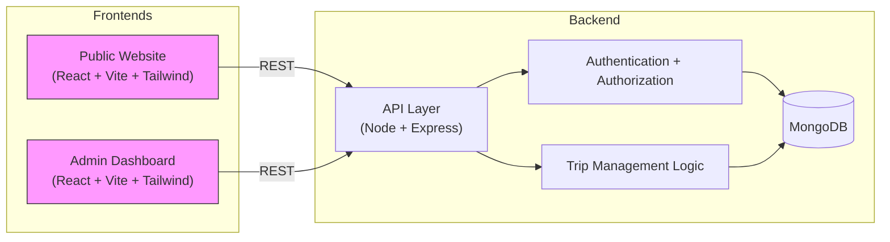

# Updated Architecture — React Microfrontends (Vite + Tailwind)

## TLDR
Both the Public site and the Admin dashboard have been consolidated into React microfrontends to separate server and client concerns, standardize the stack for easier maintainability, enable component and design-system reuse, speed developer onboarding, improve developer productivity and testing consistency, and allow independent deployments for faster iteration. This modernization replaces Handlebars.js in the customer-facing application and Angular in the admin application with a unified React solution. The legacy `app_server` (Handlebars) and `app_admin` (Angular) apps have been removed entirely.

Each frontend is built with **Vite** rather than Next.js. Both are pure client-side SPAs that call the existing Express/Mongo API directly, so there is no server-rendering layer to introduce; Vite gives the same standardized React tooling (dev server, build, TypeScript) with a much lighter dependency footprint. **Biome** replaces ESLint for linting/formatting, and **Tailwind CSS** (installed locally, not via CDN) replaces both the legacy hand-written CSS and the Bootstrap CDN `<link>`/`<script>` tags the old admin app depended on. No external resources — every stylesheet, script, and asset is bundled locally.

Trip descriptions from the API are rendered as plain text (HTML tags stripped) rather than injected via `dangerouslySetInnerHTML`, removing a stored-XSS surface that existed in the original Handlebars/Angular templates.

## Structure
```
travlr/
  app_api/          Express + Mongoose API (unchanged)
  apps/
    public/          React + Vite + Tailwind public site
    admin/           React + Vite + Tailwind admin dashboard
  app.js              Express entrypoint: /api routes only, CORS allow-list for both frontends
```

## Architecture Diagram



## Running It

```
npm run dev:api      # Express + Mongo API on :3000 (from travlr/)
npm run dev:public   # React public site on :5173 (from travlr/)
npm run dev:admin    # React admin dashboard on :5174 (from travlr/)
```

Both frontends read `VITE_API_BASE_URL` (see `.env.example` in each app), defaulting to `http://localhost:3000/api`. `app.js` allows CORS from `localhost:5173` and `localhost:5174` only.

## Notes
- Both frontends use React + Vite + Tailwind as microfrontends so teams share tooling, CI, and a component/design-system vocabulary; Biome standardizes lint/format across them.
- `apps/public` fully supersedes the old `app_server`/Handlebars site; `apps/admin` fully supersedes the old `app_admin`/Angular dashboard. Both legacy folders have been deleted, along with the `hbs` dependency and the Handlebars view-engine wiring in `app.js`.
- Backend remains Node/Express with MongoDB; APIs are unchanged (`/api/trips`, `/api/login`, `/api/register`) and now serve two frontends via an explicit CORS allow-list.
- The admin dashboard moved from Angular's localStorage-stashed trip code (set on card click, read on the edit page) to a `/edit-trip/:code` route param — a small design improvement that removes a hidden coupling between the listing and edit pages.
- Package versions for both apps (`vite`, `postcss`, `caniuse-lite`, etc.) are pinned in `package.json` `overrides` to releases older than the org Artifactory proxy's 7-day security cool-off window, so `npm install` succeeds without waiting or requesting a manual review.
